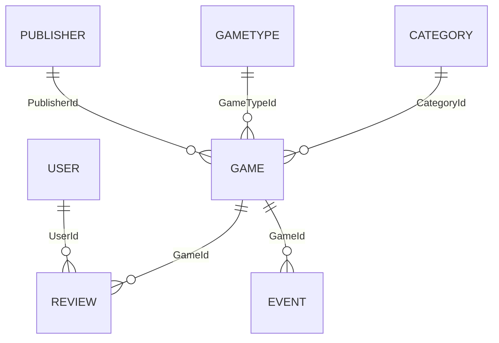

# Semantički DB model

## Sažeti popis modela, klasa i tablica

Sustav koristi 7 glavnih entiteta:
- Category
- GameType
- Publisher
- Game
- User
- Review
- Event

Sve tablice imaju primarni ključ Id tipa int.

## Glavna svojstva po entitetu

### Category
- Id: int, PK
- Name: string, obavezno, max 120
- Description: string, max 500
- AgeGroup: string, max 20
- Difficulty: enum Difficulty
- Popularity: int, raspon 0-100
- Games: kolekcija povezanih Game zapisa

### GameType
- Id: int, PK
- Name: string, obavezno, max 120
- Description: string, max 500
- Games: kolekcija povezanih Game zapisa

### Publisher
- Id: int, PK
- Name: string, obavezno, max 120
- Country: string, max 80
- Games: kolekcija povezanih Game zapisa

### Game
- Id: int, PK
- Name: string, obavezno, max 150
- Description: string, max 1000
- YearPublished: int, raspon 1900-2200
- MinPlayers: int, raspon 1-100
- MaxPlayers: int, raspon 1-100
- Difficulty: enum Difficulty
- GameTypeId: int, FK prema GameType
- PublisherId: int, FK prema Publisher
- CategoryId: int, FK prema Category
- Reviews: kolekcija povezanih Review zapisa
- Events: kolekcija povezanih Event zapisa

### User
- Id: int, PK
- Username: string, obavezno, max 80
- Email: string, obavezno, email format, max 120
- HashedPassword: string, obavezno, max 255
- Country: string, max 80
- Age: int, raspon 5-120
- Reviews: kolekcija povezanih Review zapisa

### Review
- Id: int, PK
- Rating: int, raspon 1-5
- Title: string, obavezno, max 200
- Comment: string, max 2000
- IsRecommended: bool
- CreatedAt: DateTime
- GameId: int, FK prema Game
- UserId: int, FK prema User

### Event
- Id: int, PK
- Name: string, obavezno, max 150
- GameId: int, FK prema Game
- StartDateTime: DateTime
- EndDateTime: DateTime
- Location: string, obavezno, max 200

## Veze među klasama i tablicama

### Kardinalnosti
- Category 1 -> N Game
- GameType 1 -> N Game
- Publisher 1 -> N Game
- Game 1 -> N Review
- User 1 -> N Review
- Game 1 -> N Event

### Foreign key relacije
- Game.CategoryId -> Category.Id
- Game.GameTypeId -> GameType.Id
- Game.PublisherId -> Publisher.Id
- Review.GameId -> Game.Id
- Review.UserId -> User.Id
- Event.GameId -> Game.Id

### Pravila brisanja (OnDelete)
- Game -> Category: Restrict
- Game -> GameType: Restrict
- Game -> Publisher: Restrict
- Review -> Game: Restrict
- Review -> User: Cascade
- Event -> Game: Cascade

## Napomena o seed podacima

Model je inicijalno napunjen seed podacima kroz EF Core HasData za sve entitete: Category, GameType, Publisher, Game, User, Review i Event.

## ER dijagram (tekstualni prikaz)

Legenda:
- `||--o{` znači "jedan prema više" (1:N).
- Naziv u navodnicima je FK stupac na "više" strani relacije.
